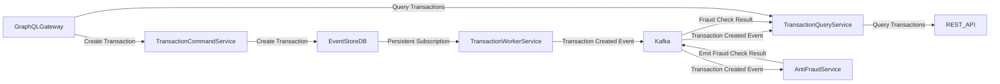

# Architecture Overview

This document outlines the architecture of the transaction management system, which employs the CQRS (Command Query Responsibility Segregation) pattern along with Event Sourcing. The system is composed of several microservices that handle different aspects of transaction processing.

## Microservices

### 1. Transaction Command Service

- **Path**: `apps/transaction-command-service`
- **Description**: This microservice is responsible for managing command operations related to transactions. It provides a gRPC interface for creating transaction events.
- **Data Storage**: Events are stored in EventStoreDB stream.
- **Communication**:
  - Listens for commands to create transactions and processes them accordingly.

### 2. Transaction Worker Service
- **Path**: `apps/transaction-worker-service`
- **Description**: This microservice is responsible for listening to EventStoreDB events  and publishing them to Kafka.
- **Communication**:
  - Consumes events from EventStoreDB transaction persistent subscription and publishes them to Kafka `transaction-created` topic.

### 3. Transaction Query Service

- **Path**: `apps/transaction-query-service`
- **Description**: This microservice handles query operations for transactions. It provides a REST API for querying a denormalized transaction table.
- **Data Storage**: The service maintains a denormalized table in CockCroachDB that is populated based on events consumed from Kafka.
- **Communication**:
  - Consumes events from the `transaction-created` topic to populate the denormalized transaction table.
  - Consumes events from the `fraud-check-result` topic to update the status of transactions.

### 4. Anti-Fraud Service

- **Path**: `apps/anti-fraud-service`
- **Description**: This event-driven microservice is responsible for validating transactions for potential fraud. It consumes transaction events and emits the results of the validation.
- **Communication**:
  - Consumes events from the `transaction-created` topic to validate transactions.
  - Emits results to the `fraud-check-result` topic, indicating whether a transaction is approved or rejected.

### 5. GraphQL Gateway

- **Path**: `apps/graphql-gateway`
- **Description**: This gateway provides a unified GraphQL API that integrates both command and query operations.
- **Functionality**:
  - Queries the read model via REST from the `transaction-query-service`.
  - Creates transaction events via gRPC from the `transaction-command-service`.

## Architecture Diagram

## Summary

This architecture leverages the strengths of CQRS and Event Sourcing to create a scalable and maintainable transaction management system. Each microservice is responsible for a specific aspect of the transaction lifecycle, ensuring clear separation of concerns and enabling independent scaling and deployment.

## Contributing

Contributions to this architecture or the underlying codebase are welcome! Please open an issue or submit a pull request for any improvements or suggestions.

## License

This project is licensed under the MIT License - see the [LICENSE](LICENSE) file for details.
